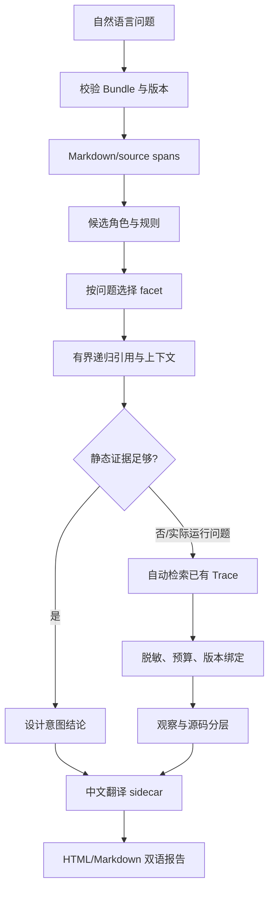

# Question Explanation Pipeline

Skill Lens answers a user's question about a Skill in two evidence layers.

“静态证据足够”只表示问题需要的来源片段和可执行规则已经被定位。它不
证明模型遵循规则，也不证明宿主加载了 Skill。静态关系图的邻接、文件名、
标题顺序和名称相似度都不能单独变成执行链路。

Markdown 按四步进入解释：

1. 保留原始文件、行号、完整段落/表格行和 heading scope。
2. 对每个 span 生成带信号的候选角色：identity、trigger、audience、
   instruction、constraint、condition、prohibition、output 或 reference。
3. 从规则中保留完整限定语、例外和条件，解析 Markdown 链接只指向同一
   Bundle 中真实存在的 span；外部或缺失目标成为 gap。
4. 围绕问题 facet 有界 BFS。超过深度、节点、字符预算，遇到循环，或找
   不到引用目标，都写入 stop reason，而不是静默删掉。

历史记录是后备证据源。系统读取已经存在的 JSON/JSONL 会话或日志，跳过
私有 reasoning、系统提示词和凭据字段；Codex、Claude、Hook、MCP 与通用
事件通过适配器归一化。工具调用和返回只有在显式 call ID 相同的时候才建立
边。每个事件保留原始记录哈希与行号定位；切片始终标为 partial。

报告的主答案只使用通过出处校验的规则或明确观察。不能回答的部分列在
“尚未确认”，包括模型内部推理、是否严格遵循、读者是否理解、缺失的版本
绑定和未找到的历史记录。

翻译层位于证据层之后。它只把已有 Claim 和源码节点映射成 `zh-CN` 阅读文本，
并保留原文、节点 ID、Graph 哈希与翻译状态。翻译失败或覆盖不完整时继续输出
原文和“暂无中文对照”，不能把翻译文本写回 Bundle，也不能让译文参与证据引用。
面向普通读者的 `overview` 是同一层的表达辅助：它可以把已绑定的规则整理成
“输入 → 判断 → 参数 → 约束 → 检查 → 输出”机制链，并为每个模块标出可观察检查项；
没有对应源码节点的模块会被拒绝加载。
